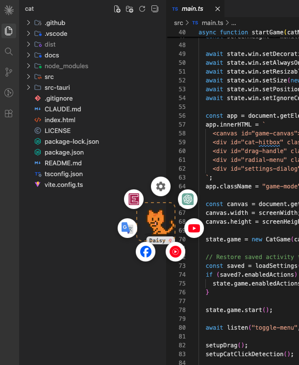
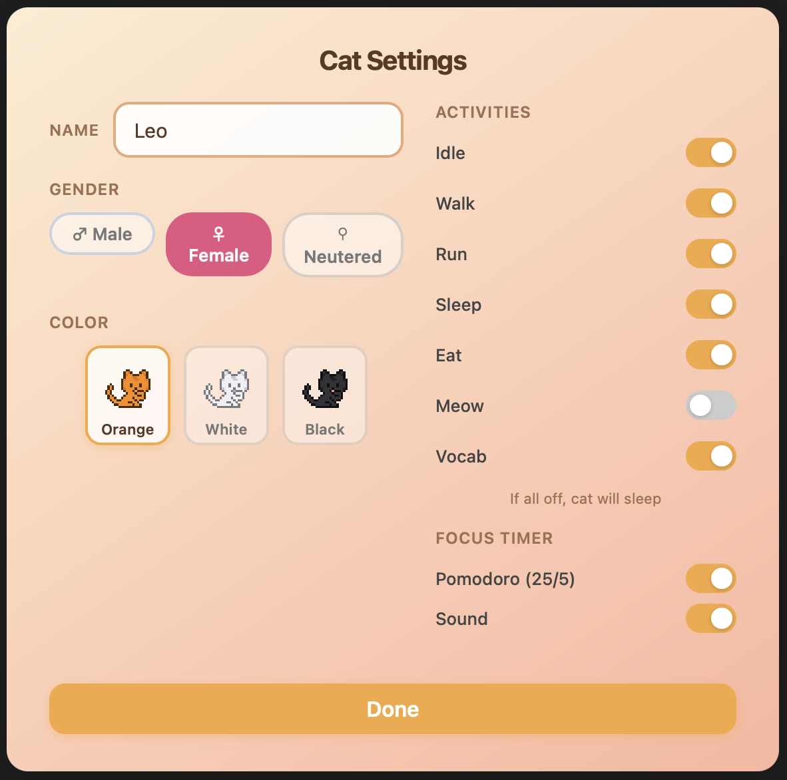

# Cat

### Installation

Download the latest release for your platform:

| Platform              | Download                                                                                                        | Note                                                                |
| --------------------- | --------------------------------------------------------------------------------------------------------------- | ------------------------------------------------------------------- |
| macOS (Apple Silicon) | [Cat_0.1.0_aarch64.dmg](https://github.com/quochuydev/cat/releases/latest/download/Cat_0.1.0_aarch64.dmg)       | Run `xattr -cr /Applications/Cat.app && open /Applications/Cat.app` |
| macOS (Intel)         | [Cat_0.1.0_x64.dmg](https://github.com/quochuydev/cat/releases/latest/download/Cat_0.1.0_x64.dmg)               | Run `xattr -cr /Applications/Cat.app && open /Applications/Cat.app` |
| Windows               | [Cat_0.1.0_x64-setup.exe](https://github.com/quochuydev/cat/releases/latest/download/Cat_0.1.0_x64-setup.exe)   | Click **More info** → **Run anyway**                                |
| Linux (deb)           | [cat_0.1.0_amd64.deb](https://github.com/quochuydev/cat/releases/latest/download/cat_0.1.0_amd64.deb)           |                                                                     |
| Linux (AppImage)      | [cat_0.1.0_amd64.AppImage](https://github.com/quochuydev/cat/releases/latest/download/cat_0.1.0_amd64.AppImage) | Run `chmod +x` before opening                                       |

### UI

### Security

The source code is public, NO any personal information send to server or external.
